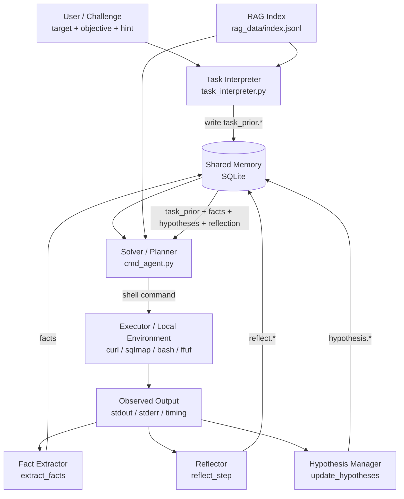

# Blackbox CTF Knowledge Base

This folder is a local-first knowledge base for blackbox-oriented CTF and web penetration workflows.

## Layout

- `repos/`: upstream knowledge sources cloned from public repositories
- `notes/`: retrieval strategy and source tagging notes
- `scripts/`: sync scripts

## Current Sources

- `PayloadsAllTheThings`: payload patterns and bypass tricks
- `hacktricks`: practical attack checklists and methodology
- `nuclei-templates`: vulnerability detection templates
- `OWASP-CheatSheetSeries`: defensive/offensive best practices and protocol references
- `fuzzdb`: fuzz payloads and probe dictionaries
- `SecLists` (sparse): targeted wordlists for web content discovery, fuzzing, payloads, credentials, usernames

## Suggested RAG Use in Blackbox CTF

1. Intent routing:
   - `recon` -> SecLists, HackTricks, OWASP
   - `payload generation` -> PayloadsAllTheThings, fuzzdb, SecLists/Payloads
   - `vuln validation` -> nuclei-templates, HackTricks, OWASP
   - `bypass tuning` -> PayloadsAllTheThings, HackTricks
2. Chunking:
   - markdown/yaml/txt chunk size: 500-1200 tokens
   - keep section title + file path as metadata
   - preserve code blocks as independent chunks
3. Retrieval:
   - hybrid retrieval (BM25 + embedding)
   - rerank with query-aware rules (payload-heavy query => prioritize payload repos)
4. Feedback loop:
   - store execution result as memory (`success/failure`, status code, response signature)
   - use self-reflection to avoid repeating failed payload families

## Sync

```bash
cd /Users/Dremig/stduy/research/ctf-agent/blackbox-kb
./scripts/sync_sources.sh
```

## Minimal RAG Quick Start

1. Create env file:

```bash
cd /Users/Dremig/stduy/research/ctf-agent/blackbox-kb
cp .env.example .env
```

2. Edit `.env` and set at least:

```bash
OPENAI_API_KEY=your_key
```

3. Build index:

```bash
./scripts/build_rag_index.sh
```

4. Ask:

```bash
./scripts/ask_rag.sh "针对一个疑似SSTI输入点，先做哪些黑盒验证？"
```

Hybrid retrieval is enabled by default. You can tune:

```bash
./scripts/ask_rag.sh "如何验证SSRF并区分内网探测回显?" --mode hybrid --top-k 8 --alpha 0.7
./scripts/ask_rag.sh "xss filter bypass payload" --mode bm25 --top-k 10
```

## Web Agent (Interpreter + Solver)

Build index first, then run:

```bash
./scripts/build_rag_index.sh
./scripts/run_web_agent.sh "http://127.0.0.1:8080/" "Find SQL injection and retrieve flag"
```

Architecture:

1. `task_interpreter` reads `objective + hint + observed signals + RAG context`
2. interpreter writes `task_prior.*` into shared sqlite memory
3. solver reads:
   - task priors
   - persistent facts
   - hypotheses
   - reflection constraints
4. solver outputs one concrete shell command each step
5. command output updates:
   - facts
   - reflection state
   - hypothesis lifecycle
6. interpreter is refreshed periodically or after drift / repeated low-gain failure

Architecture diagram:



Shared-memory data model:

```text
task_prior.*   -> interpreter-produced priors
facts          -> runtime observations and extracted signals
reflect.*      -> failure reason, strategy update, next-step constraints
hypothesis.*   -> candidate / confirmed / weak_candidate / rejected
events         -> compact execution trace
```

Optional in `.env`:

```bash
OPENAI_AGENT_MODEL=gpt-5.2
```

Main modules:

1. `rag/task_interpreter.py`
2. `rag/solver_shared.py`
3. `rag/cmd_agent.py`

Execution workflow is phase-based:

1. recon
2. probe
3. exploit
4. extract
5. verify
6. summarize and save run log to `logs/cmd_agent_last_run.json`

Memory database:

1. default path: `logs/agent_memory.sqlite`
2. shared by interpreter and solver under one `run_id`
3. stores:
   - `task_prior.*`
   - extracted `facts`
   - `reflect.*`
   - `hypothesis.*`
4. designed to be vuln-agnostic (not SQL-only)

Control policy:

1. phase state machine: `recon -> probe -> exploit -> extract -> verify`
2. interpreter priors strongly constrain solver drift
3. action validator blocks low-value repeats
4. each step records an `info_gain` score from newly discovered facts
5. each step generates a `reflection`
6. hypotheses are explicitly tracked as:
   - `candidate`
   - `confirmed`
   - `weak_candidate`
   - `rejected`

Interpreter behavior:

1. converts `description + shown information` into `task_prior`
2. identifies likely challenge family and tech stack
3. proposes:
   - primary hypotheses
   - secondary hypotheses
   - deprioritized routes
   - exploit chain candidates
4. prevents the solver from drifting too early into unrelated routes

Solver behavior:

1. plans one concrete command at a time
2. executes commands in the local environment
3. extracts facts from output
4. updates reflection and hypotheses
5. uses shared memory as the main control surface

## Quick Fuzz (No LLM)

```bash
./scripts/run_quick_fuzz.sh "http://127.0.0.1:8080/" path path-small
./scripts/run_quick_fuzz.sh "http://127.0.0.1:8080/search" param-value ssti
```

Supported default wordlists:

1. `path-small`
2. `param-names`
3. `ssti`
4. `xss`
5. `cmdi`
