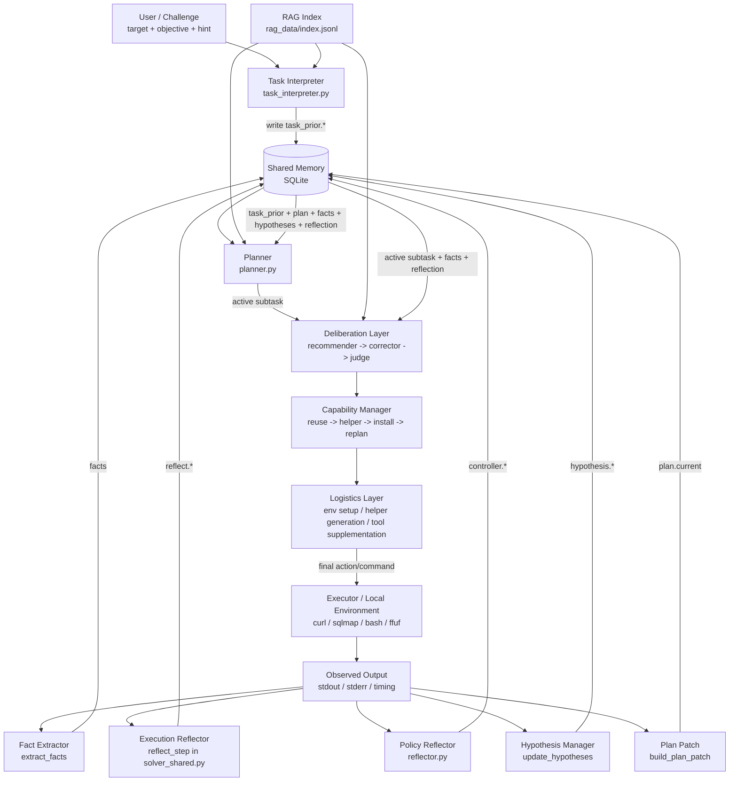

# Blackbox CTF Agent + Knowledge Base

This repo is a local-first blackbox CTF workspace with two core layers:
- retrieval (`rag/`)
- execution agent (`web_agent/`)

## Layout

- `repos/`: upstream knowledge sources cloned from public repositories
- `notes/`: retrieval strategy and source tagging notes
- `scripts/`: sync/build/run entry scripts
- `rag/`: retrieval and index utilities
- `web_agent/`: interpreter + planner + deliberation + capability manager + logistics layer + shared runtime state
- `docs/`: architecture and iteration notes (`init`, `pentagi`)

## Design Docs

- `docs/init.md`: current baseline thinking after removing legacy `sync/`
- `docs/pentagi.md`: PentAGI-driven integration notes and follow-up decisions

## Current Sources

- `PayloadsAllTheThings`: payload patterns and bypass tricks
- `hacktricks`: practical attack checklists and methodology
- `nuclei-templates`: vulnerability detection templates
- `OWASP-CheatSheetSeries`: defensive/offensive best practices and protocol references
- `fuzzdb`: fuzz payloads and probe dictionaries
- `SecLists` (sparse): targeted wordlists for web content discovery, fuzzing, payloads, credentials, usernames

## Suggested RAG Use in Blackbox CTF

1. Intent routing:
   - `recon` -> SecLists, HackTricks, OWASP
   - `payload generation` -> PayloadsAllTheThings, fuzzdb, SecLists/Payloads
   - `vuln validation` -> nuclei-templates, HackTricks, OWASP
   - `bypass tuning` -> PayloadsAllTheThings, HackTricks
2. Chunking:
   - markdown/yaml/txt chunk size: 500-1200 tokens
   - keep section title + file path as metadata
   - preserve code blocks as independent chunks
3. Retrieval:
   - hybrid retrieval (BM25 + embedding)
   - rerank with query-aware rules (payload-heavy query => prioritize payload repos)
4. Feedback loop:
   - store execution result as memory (`success/failure`, status code, response signature)
   - use self-reflection to avoid repeating failed payload families

## Sync

```bash
cd mako
./scripts/sync_sources.sh
```

## Minimal RAG Quick Start

1. Create env file:

```bash
cd mako
cp .env.example .env
```

2. Edit `.env` and set at least:

```bash
OPENAI_API_KEY=your_key
```

3. Build index:

```bash
./scripts/build_rag_index.sh
```

4. Ask:

```bash
./scripts/ask_rag.sh "针对一个疑似SSTI输入点，先做哪些黑盒验证？"
```

Hybrid retrieval is enabled by default. You can tune:

```bash
./scripts/ask_rag.sh "如何验证SSRF并区分内网探测回显?" --mode hybrid --top-k 8 --alpha 0.7
./scripts/ask_rag.sh "xss filter bypass payload" --mode bm25 --top-k 10
```

## Web Agent (Interpreter + Solver)

Build index first, then run:

```bash
./scripts/build_rag_index.sh
./scripts/run_web_agent.sh "http://127.0.0.1:8080/" "Find SQL injection and retrieve flag"
```

Architecture:

1. `task_interpreter` reads `objective + hint + observed signals + RAG context`
2. interpreter writes `task_prior.*` into shared sqlite memory
3. planner turns priors and runtime evidence into explicit subtasks
4. solver deliberation reads:
   - task priors
   - active subtask
   - persistent facts
   - hypotheses
   - reflection constraints
5. controller reflection runs in parallel and emits policy constraints
6. validator layer blocks phase drift, low-gain repeats, and semantic-recovery violations
7. recommender proposes one concrete action/command, corrector attacks it, and judge selects the final executable step
8. capability manager evaluates execution gaps (`reuse existing action` vs `write helper` vs `install dependency` vs `replan`)
9. logistics layer executes environment/setup work requested by capability resolution and records it outside challenge-step counting
10. command output updates:
   - facts
   - reflection state
   - hypothesis lifecycle
   - plan patches for follow-up subtasks
11. interpreter/planner are refreshed periodically or after drift / repeated low-gain failure

Architecture diagram:



Current runtime stack:

```text
task_interpreter -> planner -> recommender -> corrector -> judge
                   -> capability -> logistics -> executor
executor -> fact extraction / hypothesis updates / execution reflection / policy reflection
          -> plan patch -> planner
```

Shared-memory data model:

```text
task_prior.*   -> interpreter-produced priors
facts          -> runtime observations and extracted signals
reflect.*      -> failure reason, strategy update, next-step constraints
plan.*         -> current plan, active subtask title/phase/action hint
controller.*   -> policy reflection outputs (must_do / must_avoid / clusters)
hypothesis.*   -> candidate / confirmed / weak_candidate / rejected
run.*          -> challenge-step and capability-step counters
events         -> compact execution trace
flows          -> run-level status
tasks_state    -> objective-level execution status
subtasks_state -> step-level execution status and outcome
```

Optional in `.env`:

```bash
OPENAI_AGENT_MODEL=gpt-5.2
```

Main modules:

1. `rag/index.py`, `rag/query.py`, `rag/agent.py`, `rag/common.py`
2. `web_agent/task_interpreter.py`
3. `web_agent/planner.py`
4. `web_agent/deliberation.py`
5. `web_agent/capability.py`
6. `web_agent/logistics.py`
7. `web_agent/reflector.py`
8. `web_agent/solver_shared.py`
9. `web_agent/cmd_agent.py`

Execution workflow is phase-based:

1. recon
2. probe
3. exploit
4. extract
5. verify
6. summarize and save run log to `logs/cmd_agent_last_run.json`

Memory database:

1. default path: `logs/agent_memory.sqlite`
2. shared by interpreter and solver under one `run_id`
3. stores:
   - `task_prior.*`
   - extracted `facts`
   - `reflect.*`
   - `hypothesis.*`
4. designed to be vuln-agnostic (not SQL-only)

Control policy:

1. phase state machine: `recon -> probe -> exploit -> extract -> verify`
2. interpreter priors strongly constrain solver drift
3. planner owns an explicit ordered subtask list and exposes one active subtask at a time
4. reflector/controller outputs are used to patch the current plan
5. action validator uses modular rule registries (semantic rules + controller rules)
6. failure reasons are normalized and mapped to canonical failure clusters
7. capability acquisition is a separate loop and does not consume challenge-step budget
8. each step records an `info_gain` score from newly discovered facts
9. each step generates a `reflection`
10. hypotheses are explicitly tracked as:
   - `candidate`
   - `confirmed`
   - `weak_candidate`
   - `rejected`

Interpreter behavior:

1. converts `description + shown information` into `task_prior`
2. identifies likely challenge family and tech stack
3. proposes:
   - primary hypotheses
   - secondary hypotheses
   - deprioritized routes
   - exploit chain candidates
4. prevents the solver from drifting too early into unrelated routes

Deliberation behavior:

1. recommender proposes one executable step for the active subtask
2. corrector aggressively finds weaknesses and may replace that step with a corrected executable proposal
3. judge selects the final proposal before execution
4. execution results are written back into memory
5. reflection and planner patches update subsequent subtasks
6. supports structured actions for brittle execution chains:
   - `http_probe_with_baseline`
   - `extract_html_attack_surface`
   - `cookiejar_flow_fetch`
   - `service_recovery_probe`
   - `multipart_upload_with_known_action`
   - `build_jsp_war`
   - `tomcat_manager_read_file`

Capability and logistics behavior:

1. capability resolution detects whether the chosen proposal lacks a required tool or dependency
2. capability scoring prefers:
   - existing structured action
   - generated helper script
   - controlled install
   - replan
3. logistics strategy selection is model-driven (`pip` vs `system_package_manager` vs `skip_install`) with deterministic safety fallback
4. logistics executes support work for the chosen option
5. logistics work is tracked as `capability_steps` and does not consume `challenge_steps`
6. install targets are dynamic (not a fixed allowlist), but install timing is constrained by capability-policy and step accounting

## Quick Fuzz (No LLM)

```bash
./scripts/run_quick_fuzz.sh "http://127.0.0.1:8080/" path path-small
./scripts/run_quick_fuzz.sh "http://127.0.0.1:8080/search" param-value ssti
```

Supported default wordlists:

1. `path-small`
2. `param-names`
3. `ssti`

## FAQ

Q: What does "mako" mean in this project?
A: `mako` refers to Hitachi Mako (常陆茉子) and has no other meaning.

问：这个项目里的 “mako” 是什么意思？
答：`mako` 指的是常陆茉子，除此之外没有任何含义。

質問：このプロジェクトにおける「mako」は何を意味しますか？
回答：`mako` は常陸茉子を指し、それ以外の意味はありません。
4. `xss`
5. `cmdi`
