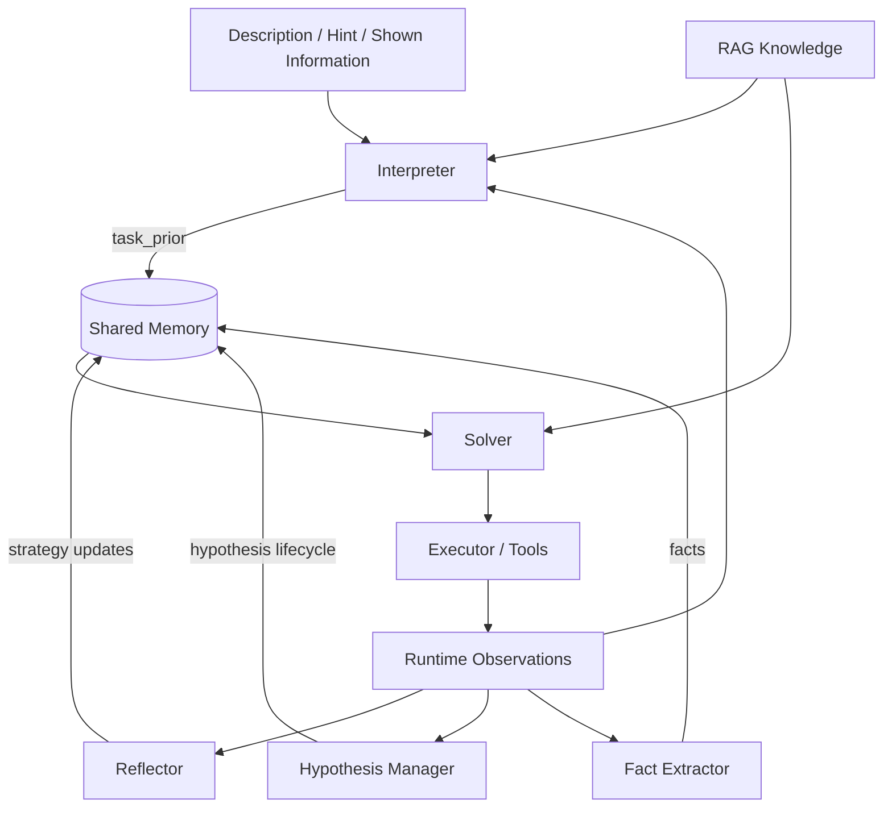

# Agent Evolution Principles

这份笔记不讨论某一道题，而讨论黑盒 CTF agent 为什么会进步、为什么会停滞。

## 1. 单次成功不代表系统进步

一个 agent 偶尔做出一道题，不等于系统真的变强。

更重要的是：

- 是否能从零开始稳定发现入口
- 是否能在不同题型下保持阶段推进
- 是否能在失败后缩小搜索空间
- 是否能沉淀策略而不是重复犯错

因此，评价标准不能只是 `拿没拿到 flag`，而必须包括：

- 入口发现成功率
- 假设收敛速度
- 平均无效动作数
- 平均重复动作数
- exploitation 阶段超时率

## 2. RAG 不是核心控制器

RAG 很重要，但它主要解决的是：

- 知识补全
- payload 家族召回
- 验证顺序提示
- 已知技术路线参考

RAG 不解决这些问题：

- 当前该处于哪个阶段
- 哪个假设应该继续
- 上一步失败意味着什么
- 什么时候应该停止某条路线

所以，RAG 应该被视为增强层，而不是控制核心。

## 3. 真正的核心是状态管理

黑盒 agent 最容易失败的原因，不是缺知识，而是缺状态控制。

必须至少维护这几类状态：

- `phase`
- `facts`
- `hypotheses`
- `action history`
- `strategy constraints`
- `failure lessons`

如果这些状态没有显式存在，系统就只能依赖模型的短上下文记忆，结果必然不稳。

当前实现已经演进为：

- `Interpreter` 负责生成 `task_prior`
- `Solver` 负责执行命令
- `Memory` 负责共享先验、事实、反思、假设

这比单 agent 直接做题更稳，因为它把“题意理解”和“运行时执行”拆开了。

可以把当前架构抽象为：

这张图的关键不是“模块多”，而是：

- 题意理解和执行解耦
- 所有更新都回到共享状态
- 下一轮决策读取的是状态，而不是原始日志

## 4. 假设必须被管理，而不是被感受

很多 agent 的 planner 看起来像在“思考”，但实际上没有正式管理假设。

应该显式区分：

- `candidate hypothesis`
- `confirmed hypothesis`
- `rejected hypothesis`
- `stale hypothesis`

例如：

- `possible_sqli(questionid)` 可以先是 candidate
- 出现错误/时延差异后升级为 confirmed
- 多轮无信号则降级或 reject

没有这一层，agent 就会出现：

- 方向来回跳
- 同一假设无限续命
- 错误路线长期占用预算

## 5. 自反思不是 prompt，而是机制

很多系统会在 prompt 里写：

- think carefully
- reflect before acting
- revise your plan

这不够。

真正的自反思需要：

1. 对失败做分类
2. 对策略做更新
3. 把更新结果写入状态
4. 下一轮强制读取这些更新

换句话说，自反思必须是系统状态转移的一部分，而不是一次临时文案。

当前实现已经具备：

- `reflect.last_judgment`
- `reflect.last_failure_reason`
- `reflect.last_strategy_update`
- `reflect.constraint.*`

下一步重点不再是“有没有 reflect”，而是“reflect 的失败分类是否足够准确”。

## 6. 动作必须由信息增益驱动

一个动作是否值得执行，关键不在“它是否看起来合理”，而在“它是否可能产生新信息”。

高质量动作应该满足：

- 可比较：有 baseline
- 可归因：结果对应明确假设
- 可复现：命令能再跑
- 可终止：有超时和中止条件

低质量动作通常表现为：

- 重复读取同一页面
- 扫得很大但不能指导下一步
- 结果出来后也无法判断假设真假

## 7. 参数发现必须先保守，再扩张

入口发现是黑盒 agent 的第一道生死线。

如果入口发现过宽，会导致：

- 假参数污染 memory
- planner 被错误事实误导
- exploit 阶段浪费在不存在的入口上

因此更合理的策略是：

- 先高精度、低召回
- 再逐步放宽

先错过一些入口，比把整个状态空间污染掉要安全得多。

## 8. 工具要有能力画像

“环境里有哪些命令”不等于“agent 知道什么时候该用什么工具”。

工具应该被建模为：

- `name`
- `capabilities`
- `preconditions`
- `cost`
- `stability`
- `observability`

例如：

- `curl` 适合 baseline 与轻探测
- `sqlmap` 适合 confirmed SQLi 后的 exploitation
- `ffuf` 适合路径和参数空间扩展

没有能力画像，模型容易把工具调用退化成随机尝试。

## 9. 通用能力比题型适配更重要

一个系统如果只会解 SQLi，价值有限。

真正要追求的是跨题型通用能力：

- recon
- probe
- diff
- hypothesis update
- exploitation policy switch
- extraction verification

SQLi、SSRF、SSTI、LFI 的不同，更多体现在 payload 与信号族上，而不是整体控制框架上。

因此更合理的架构是：

1. 先由 `Interpreter` 给出高概率路线
2. `Solver` 先走最像的一条
3. `Reflector` 在失败后决定是降载、换工具还是换路线
4. `Memory` 记录整个过程

这比“所有事情都交给一个 planner”更接近黑盒做题的真实过程。

## 10. 轨迹是未来最重要的数据资产

如果系统只做题、不沉淀轨迹，就永远停留在“每次重新开始”。

应沉淀的数据包括：

- 成功动作链
- 失败模式
- 不同题型的典型阶段迁移
- 工具参数模板
- 反思结果

未来无论你做：

- 检索增强
- 策略蒸馏
- 自部署模型微调
- reranker 训练

这些轨迹都是最核心的数据来源。

## 11. 当前最值得投入的方向

对现阶段系统而言，投入产出比最高的方向不是继续堆知识，而是：

1. `reflect` 机制
2. 假设生命周期管理
3. 信息增益评分
4. 工具能力建模
5. exploitation 降载与停止策略

## 12. 一句话总结

黑盒 CTF agent 的上限，不由它知道多少 payload 决定，而由它是否能：

- 管理状态
- 管理假设
- 管理失败
- 管理预算

这四点做好了，RAG、工具链、甚至底模替换才会真正产生复利。
